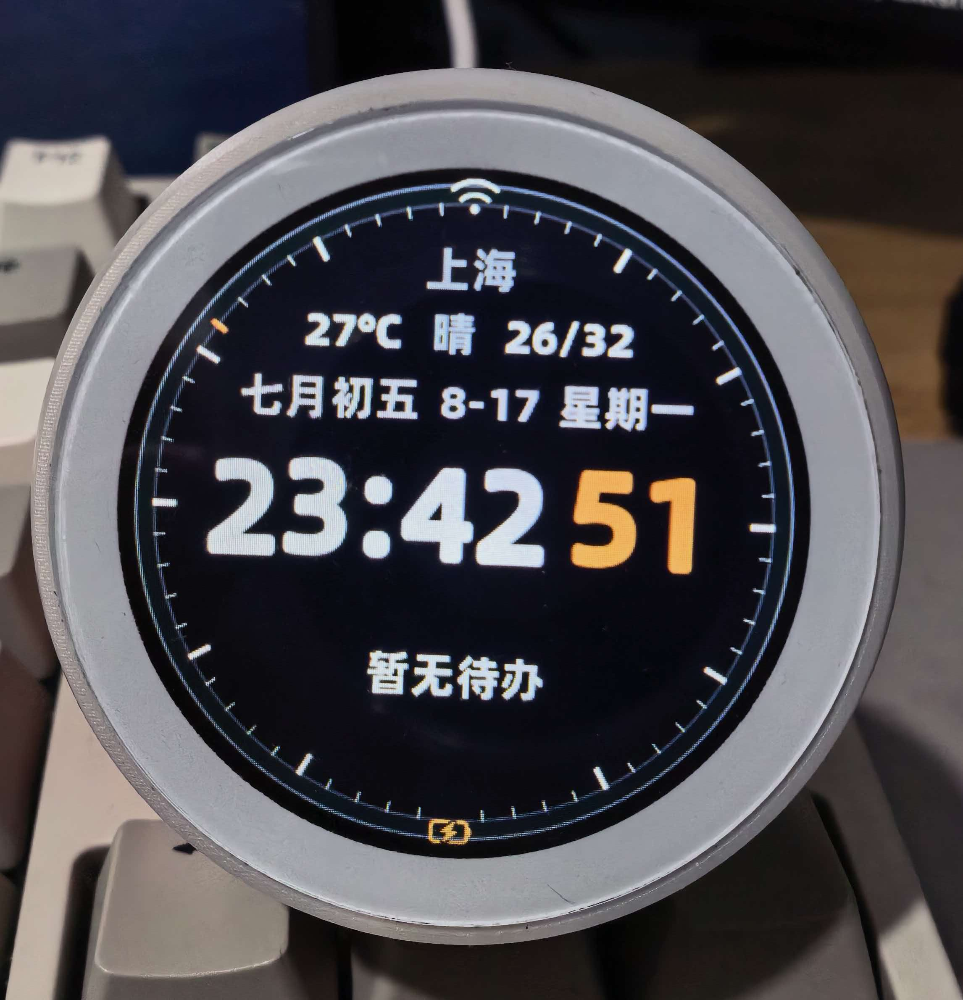

# TuntunLife 多板型语音助手固件

基于 **阿慕希（MoveCall）Moji2.0 智能语音终端硬件**及其板级固件代码，结合
[xiaozhi-esp32](https://github.com/78/xiaozhi-esp32) 官方代码演进而来，并在此基础上
开发了囤囤AI平台接入等特有功能。当前已验证 `movecall-moji2-esp32c5` 板型，构建系统
支持通过独立板型目录扩展其他 ESP32 芯片和硬件。



## 项目起源与致谢

- **硬件设计**：[Moji 2.0 小智AI桌面机器人5GWi-Fi长续航 · 嘉立创开源硬件平台](https://oshwhub.com/movecall/moji2)
- **板级固件参考**：[MoveCall（阿慕希）· xiaozhi-esp32 · movecall-moji2-esp32c5 板型](https://github.com/MoveCall/xiaozhi-esp32/tree/main/main/boards/movecall-moji2-esp32c5)
- **基础框架**：[xiaozhi-esp32](https://github.com/78/xiaozhi-esp32) v2.2.6

## 硬件

- ESP32-C5 N16R8
- ES8311 音频 Codec
- ST77916 360x360 QSPI LCD
- 单麦克风、扬声器、WS2812 状态灯

## 特有功能

- **囤囤AI平台接入**：语音绑定设备、语音设置天气位置、备忘录全链路语音操作、
  动态 MCP 工具下发与代理执行、主动通知（详见[囤囤AI平台接入](#囤囤ai平台接入)）
- **圆屏交互**：金属黑时钟表盘屏保（本地公历转农历）、天气与备忘录屏保卡片、
  自定义 MCP 清单表盘
- **对话与音频优化**：唤醒词打断、播放排空回调、任务优先级调度
- **多板型构建框架**：板型目录自包含契约（`main/boards/<board>/`），新增板型不改公共代码
- **安全发布流程**：Secure Boot V2 + Release 模式 Flash Encryption + 防降级，一键打包合并镜像
- **ESP-IDF 6.0.2 适配**：依赖与 LCD 结构体已按 IDF 6 迁移并真机验证

## 构建

要求 **ESP-IDF 6.0.2**（本项目已按 IDF 6.0.2 适配；使用 5.5.x 会因组件与结构体差异无法编译）。

```bash
python scripts/build.py --list-boards
python scripts/build.py movecall-moji2-esp32c5 build
```

开发构建固定输出到 `build/<board>/debug`。目标芯片和 sdkconfig 默认值由板型目录
自动提供，不需要先执行 `idf.py set-target`。也可以直接使用：

```bash
idf.py -B build/movecall-moji2-esp32c5/debug \
  -DBOARD_TYPE=movecall-moji2-esp32c5 build
```

新增板型只需增加 `main/boards/<board>/`，无需修改公共 CMake、Kconfig 或构建脚本。
板型目录契约见 [main/boards/README.md](main/boards/README.md)。

发布脚本固定启用 Secure Boot V2、Release 模式 Flash Encryption 和固件防降级。首次构建前需要在
项目根目录生成不会提交到 Git 的 ECDSA-256 签名私钥：

```bash
espsecure.py generate_signing_key --version 2 --scheme ecdsa256 secure_boot_signing_key.pem
```

该私钥必须离线备份，后续 OTA 固件必须继续使用同一私钥签名。发布固件首次启动会写入不可逆 eFuse，
只能在已经验证量产流程的设备上烧录；普通板型开发构建和开发烧录不会启用这些不可逆发布配置。
从旧版固件首次升级到安全发布固件时，必须烧录发布脚本生成的完整镜像；只执行应用 OTA 不会更新
Bootloader 和分区表，也不会启用 Secure Boot 与 Flash Encryption。首次完整烧录会清空原有 NVS 配置。

也可以通过板型构建脚本配置显示样式、资源和调试选项：

```bash
python scripts/build.py movecall-moji2-esp32c5 menuconfig
python scripts/build.py movecall-moji2-esp32c5 flash-monitor -p /dev/cu.usbmodemXXXX
```

固件设计说明位于 `docs/firmware`，完整文档目录见 [docs/README.md](docs/README.md)。

## 囤囤AI平台接入

### 前置：先绑定小智（xiaozhi），再绑定囤囤AI

> ⚠️ **必须按顺序绑定：先绑定小智，再绑定囤囤AI。**

囤囤AI的底层对话能力依赖小智（xiaozhi），请先完成小智平台的设备绑定，再执行下方的囤囤AI绑定流程。

在小智平台绑定设备时，**音色请选择「龙婉 女」**：囤囤AI的天气、备忘录、通知等播报均以该音色克隆，
选择它能保证小智对话与囤囤AI播报发音一致；选其它音色会出现两种人声、音色不统一。

### 绑定流程

唤醒设备并说“绑定囤囤AI平台”或“绑定设备”，屏幕会显示一次性绑定码；在囤囤AI网页(https://web.tuntun.life)端设备页面输入该绑定码即可完成绑定。
已绑定的设备再次绑定会提示“设备已绑定”；解绑需登录囤囤AI后台操作。

### 绑定后的能力

- **语音天气**：语音设置固定城市/区县，或切换公网 IP 自动定位
- **语音备忘录**：语音创建、查询、修改、删除和统计备忘录，屏保同步显示待办
- **动态 MCP 工具**：自动加载后台下发的能力清单，语音问答并代理执行
- **主动通知**：接收并播报后台推送的通知

平台地址通过 `CONFIG_TUNTUN_API_URL` 配置，可用板型构建脚本的 `menuconfig` 修改（接入自有后端时改为自建
地址，或留空禁用上述能力）。固件内置 MCP 工具的注册与调用见
[`docs/mcp-usage_zh.md`](docs/mcp-usage_zh.md) 与 [`docs/mcp-protocol_zh.md`](docs/mcp-protocol_zh.md)。

## 许可

代码采用 MIT 许可（见 [LICENSE](LICENSE)），保留上游
[xiaozhi-esp32](https://github.com/78/xiaozhi-esp32) 的版权声明。
上游项目、[MoveCall（阿慕希）板级固件](https://github.com/MoveCall/xiaozhi-esp32/tree/main/main/boards/movecall-moji2-esp32c5)、
字体/表情素材与第三方组件的许可明细见 [CREDITS.md](CREDITS.md)。
